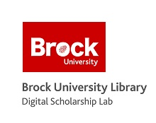

![Research Tools On Demand][title]

Using docker containers run through a Portainer interface, the Digital Scholarship Lab offers a variety of tools for collecting, analyzing, and presenting your data that are not offered anywhere else on campus!

These containers are en excellent place to conduct command line level processes without worrying about other programs on the machine interrupting or pulling resources away from your work.  Also, because they are self contained operating systems, containers are extremely secure.  Once you have completed your work, the container will be shut down and all resources used by it will be reclaimed to be used again.

Currently we support:

- Active Twitter harvesting via the TWARC tool

- Temporary Linux environments to run tests in

- Locally hosted temporary Word Press sites

For other ideas, or help on your projects, come visit us in the Rankin Family Pavilion at Brock University or e-mail us at DSL@Brocku.ca.

[title]: RTOD.png
